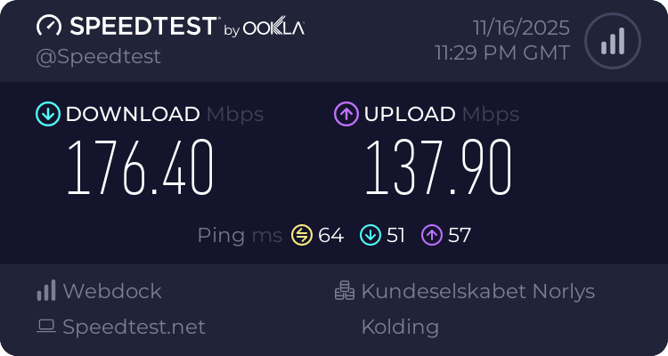
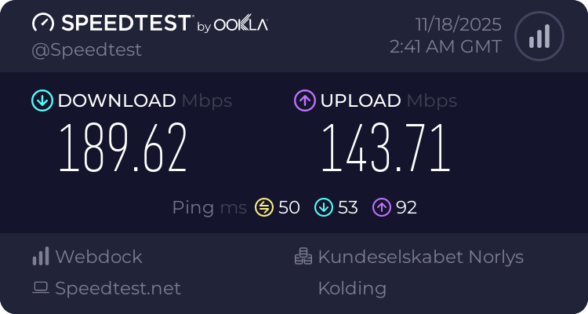

# PPP-over-HTTP/2: Having Fun with dumbproxy and pppd

I run a few instances of [dumbproxy](https://github.com/SenseUnit/dumbproxy) (simple but quite versatile forward proxy server) for my personal needs. Not so long ago, I implemented a new operation mode for it, allowing dumbproxy to be run as a subprocess and communicate with the parent process via stdin/stdout instead of listening port. It is very useful to use it as a `ProxyCommand` for OpenSSH client. More importantly, it made me realize that I'm just one small feature away from achieving something I hadn't gotten around to doing: sending PPP tunnel through a HTTP proxy!

We already have TLS securing proxy connections, flexible authentication, (optional) active probing resistance, good firewall bypassing capabilities, including resistance to state-level VPN censorship. It would be nice to bring all of these benefits to some well-known VPN protocols, enabling direct IP forwarding. While OpenVPN already has limited support for proxies, and we could just point it to a local dumbproxy instance to forward connection to a remote (parent, in Squid terms) TLS-enabled proxy, I still wanted to tinker with PPP and pay tribute to one of the oldest and most fundamental tunneling protocols - PPP. Dial-up era tunnel running over modern HTTP/2, how cool is that?!

## Starting Point

The instances I currently run have fairly basic configuration as described [here](https://github.com/SenseUnit/dumbproxy/wiki/Quick-deployment), with a few additions:

* The certificate cache is stored in shared Redis instance in order to make instances completely stateless.
* Some domains are filtered by access filter JS script.
* .onion domains are redirected to Tor instance.

All in all, it's a plain forward proxy setup with automatic certificates from LetsEncrypt and a local password database in a file.

By the way, [there is a cloud-init spec available](https://github.com/SenseUnit/dumbproxy/wiki/Cloud%E2%80%90init-configuration) to go through setup for you.

## Server Setup

Let's take a look into the redirection script (`-js-proxy-router` option). Mine was looking like this:

**/etc/dumbproxy-route.js:**

```js
function getProxy(req, dst, username) {
	if (dst.originalHost.replace(/\.$/, "").toLowerCase().endsWith(".onion")) {
		return "socks5://127.0.0.1:9050"
	}
	return ""
}
```

There is already one redirection rule, which is irrelevant for now. Let's add another one to send some special destination address into a `pppd file /etc/ppp/options.vpn` subprocess.

**/etc/dumbproxy-route.js:**

```js
function getProxy(req, dst, username) {
	if (dst.originalHost.replace(/\.$/, "").toLowerCase().endsWith(".onion")) {
		return "socks5://127.0.0.1:9050"
	}
	if (dst.originalHost.toLowerCase() == "pppd") {
		return "cmd://?cmd=pppd&arg=file&arg=/etc/ppp/options.vpn"
	}
	return ""
}
```

Make sure `pppd` is installed, it's in `ppp` package in most Linux distributions:

```
apt install ppp
```

pppd options will be

**/etc/ppp/options.vpn:**

```
nodetach
notty
noauth
172.22.255.1:172.22.255.2
ms-dns 1.1.1.1
ms-dns 8.8.8.8
```

That's enough to establish a tunnel. However, we also need a few bits to make the system actually forward traffic.

Enable IP forwarding:

```sh
echo "net.ipv4.ip_forward=1" >> /etc/sysctl.conf && sysctl -p
```

Masquerade traffic leaving through the default gateway interface:

```sh
iptables -t nat -I POSTROUTING -o $(ip route show default | head -1 | grep -Po '(?<=dev\s)\s*\S+') -j MASQUERADE
iptables -t mangle -I FORWARD -p tcp -m tcp --tcp-flags SYN,RST SYN -j TCPMSS --clamp-mss-to-pmtu
```

_Assuming you're using `iptables-persistent` package to manage iptables, you can these changes persistent across reboots like this:_

```sh
/etc/init.d/netfilter-persistent save
```

That's it - we're done with the server configuration.

## Client Setup

Let's create peer configuration for pppd.

**/etc/ppp/peers/vpn:**

```
nodetach
noauth
nodeflate
nobsdcomp
novj
novjccomp
ipparam vpn
usepeerdns
pty "/usr/local/bin/dumbproxy -proxy h2://LOGIN:PASSWORD@vps.example.org -mode stdio pppd 0"
```

where `h2://LOGIN:PASSWORD@vps.example.org` should be replaced with the specification of the remote proxy you just configured.

Here, we use the dumbproxy command as a pty command for pppd, funneling the connection into it. It connects through the upstream proxy to a fake address `pppd:0`, which the server-side router script recognizes and directs the connection straight into a pppd subprocess.

Install the dumbproxy binary (assuming Linux and amd64 architecture; for other architectures see [latest release assets](https://github.com/SenseUnit/dumbproxy/releases/latest)):

```sh
curl -Lo /usr/local/bin/dumbproxy \
	'https://github.com/SenseUnit/dumbproxy/releases/latest/download/dumbproxy.linux-amd64' \
	&& chmod +x /usr/local/bin/dumbproxy
```

Tunnel configuration is done, but we also need to add a small script to configure routing after the PPP connection is established:

**/etc/ppp/ip-up.d/vpn:**

```bash
#!/bin/bash

INTERFACE="$1"
DEVICE="$2"
SPEED="$3"
LOCALIP="$4"
REMOTEIP="$5"
IPPARAM="$6"

if [[ "$IPPARAM" != "vpn" ]] ; then
	# Not our config
	exit 0
fi

PROTECT=("vps.example.org") # Preserve route for these addresses

default_route4=$(ip -4 route show default | head -1 | cut -d\  -f2-)
default_route6=$(ip -6 route show default | head -1 | cut -d\  -f2-)

for protect_address in "${PROTECT[@]}"; do
	>&2 echo "Protecting $protect_address..."

	if [[ "$default_route4" ]]; then
		for ip in $(getent ahostsv4 "$protect_address" | cut -f1 -d\  | sort | uniq); do
			ip -4 route replace "$ip" $default_route4
		done
	fi
	if [[ "$default_route6" ]]; then
		for ip in $(getent ahostsv6 "$protect_address" | cut -f1 -d\  | sort | uniq); do
			ip -6 route replace "$ip" $default_route6
		done
	fi
done

ip -4 route replace 0.0.0.0/1   dev "$INTERFACE"
ip -4 route replace 128.0.0.0/1 dev "$INTERFACE"
# Prevent ipv6 leaks
ip -6 route replace unreachable 2000::/3 

# Workaround for bug https://lists.opensuse.org/archives/list/bugs@lists.opensuse.org/thread/ZHDF667RJDGAEWJCJB7HGWNARKLAIPGK/
#if [[ "$DNS1" ]]; then
#	resolvconf="/var/run/ppp/resolv.conf.$INTERFACE"
#	chattr -i "$resolvconf"
#	echo "nameserver $DNS1" > "$resolvconf"
#	if [[ "$DNS2" ]]; then
#		echo "nameserver $DNS2" >> "$resolvconf"
#	fi
#	chmod 0644 "$resolvconf"
#	chattr +i "$resolvconf"
#	mount --bind --onlyonce "$resolvconf" /etc/resolv.conf
#fi
```

This script installs direct route to upstream proxy hosts, ensuring already encapsulated traffic won't loop back into the tunnel. It also installs default route, preserving the original route after the PPP session shuts down.

Don't forget to replace `vps.example.org` with your actual domain name and make the script executable.

Thas's all - let's try it out!

```
user@ws:~> sudo pppd call vpn
Using interface ppp0
Connect: ppp0 <--> /dev/pts/4
MAIN    : 2025/11/18 03:54:20 main.go:656: INFO     Starting proxy server...
MAIN    : 2025/11/18 03:54:20 main.go:812: INFO     Proxy server started.
local  LL address fe80::b940:dde6:f755:0427
remote LL address fe80::e5da:861e:b382:4e83
Script /etc/ppp/ipv6-up finished (pid 47510), status = 0x0
Script /etc/ppp/ip-pre-up finished (pid 47515), status = 0x0
local  IP address 172.22.255.2
remote IP address 172.22.255.1
primary   DNS address 1.1.1.1
secondary DNS address 8.8.8.8
Script /etc/ppp/ip-up finished (pid 47520), status = 0x0
```

## Checking Out

Let's confirm we've achieved both datagram forwarding and that traffic goes through the remote server. You can contact a DNS echo server directly and see which IP address you use to reach it:

```sh
dig +trace TXT whoami.ds.akahelp.net | grep -P 'IN\s+TXT'
```

It should output the IP address of the machine at the remote end of the tunnel.

Now, the speed. Here's my result:



Not bad, considering it's a TCP-carried tunnel.

## Bonus

But we can make it even weirder! Initially, PPP was used for communication over serial lines, often carried over phone lines using a modem. Typically, the modem was connected to the computer's serial port (tty for pppd), and some program would to prepare it for actual data transfer, sending AT commands to the modem, dialing a number, maybe even sending a username-password over the line before the PPP session can be started. We can do something similar.

We can skip using dumbproxy on the client and instead use the `openssl` command line utility in conjunction with the `chat` program, which was typically used for setting up modem and expecting responses from it.

pppd peer config becomes

**/etc/ppp/peers/vpn-lite:**

```
nodetach
noauth
nodeflate
nobsdcomp
novj
novjccomp
ipparam vpn
usepeerdns
connect /usr/local/bin/dialer.sh
pty "openssl s_client -brief -verify_return_error -ign_eof vps.example.org:443"
```

Instead of a single `pty` option, we use a connect script plus the `openssl s_client` utility (which is basically like `netcat` but for SSL/TLS).

The connect script is:

**/usr/local/bin/dialer.sh:**

```sh
#!/bin/bash

USERNAME="username"
PASSWORD="password"

AUTH="$(echo -n "$USERNAME:$PASSWORD" | base64)"

exec /usr/sbin/chat -v -T "$AUTH" \
	TIMEOUT 5 \
	ABORT 'HTTP/1.1 3' \
	ABORT 'HTTP/1.1 4' \
	ABORT 'HTTP/1.1 5' \
	"" "CONNECT pppd:0 HTTP/1.1\r\nHost: pppd:0\r\nProxy-Authorization: Basic \T\r\n\r\n\c" \
	"HTTP/1.1 200" ""
```

It's just an invocation of `chat` program with an encoded login-password pair passed as a "phone number". Similarly, you can start the connection with `sudo pppd call vpn-lite` command.

Of course, this uses HTTP/1.1 instead, but maybe that's for the better - there's no overhead from HTTP/2 frame encoding/decoding. Speed looks a bit better, but likely within the error margin:


